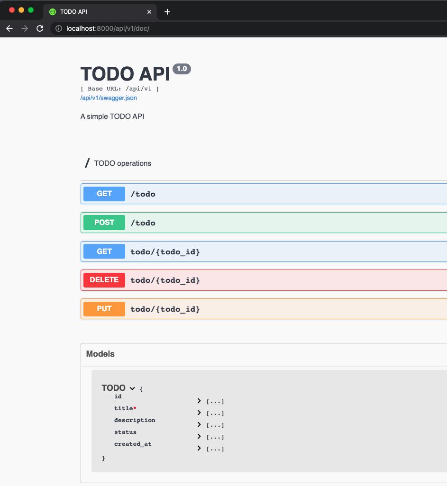

## TODO Service

This TODO service is a simple API application developed using a Layered Architecture structure partitioning. It demonstrates how to create, read, update, and delete TODO items while applying best practices and design principles.

If you want to get more context about this service visit the post: [Software Architectures: Styles and Structure Partitioning](https://luisherrera.dev/software-architectures-styles-and-structure-partitioning#heading-todo-system-example)

## Features

* **Layered Architecture:** The app uses a Layered Architecture structure partitioning, with clear separation between API routes, services, and models.
* **RESTful API:** The app exposes RESTful API endpoints to manage TODO items, including creating, retrieving, updating, and deleting operations.
* **OpenAPI Specification (Swagger):** The API is documented using the OpenAPI Specification, making it easy to understand and interact with the available endpoints.
* **Database Integration:** The app integrates with a database to store and manage the TODO items.
* **Logger:** The app includes a logging system to track application events and potential issues.
* **Tests:** The app contains a suite of unit tests to ensure the functionality of the API endpoints, services, and models

## Running the App

To run the app, you will need to use Docker Compose. Make sure you have Docker and Docker Compose installed on your machine before proceeding.

1. Clone the repository:

```bash
git clone https://github.com/herrera-luis/layered-flask-todo-service.git

cd layered-flask-todo-service/
```

2. Build and run the app using Docker Compose:

```bash
docker-compose up
```
This command will build the Docker images and start the containers for the TODO App and its associated services (e.g., the database).

3. Access the API at http://localhost:8000/api/v1/todos/ to start using the TODO App.

4. To stop the app and remove the containers, press Ctrl+C in the terminal and then run:

```bash
docker-compose down
```

5. For more information on the API endpoints and how to use them, please refer to the API documentation http://localhost:8000/api/v1/doc/.


